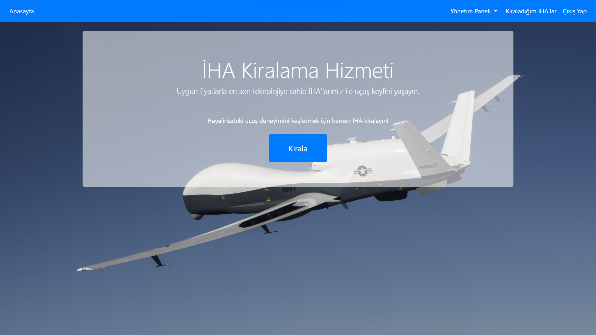
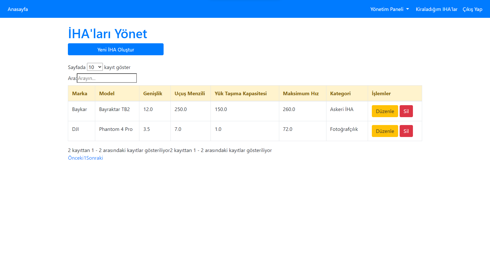
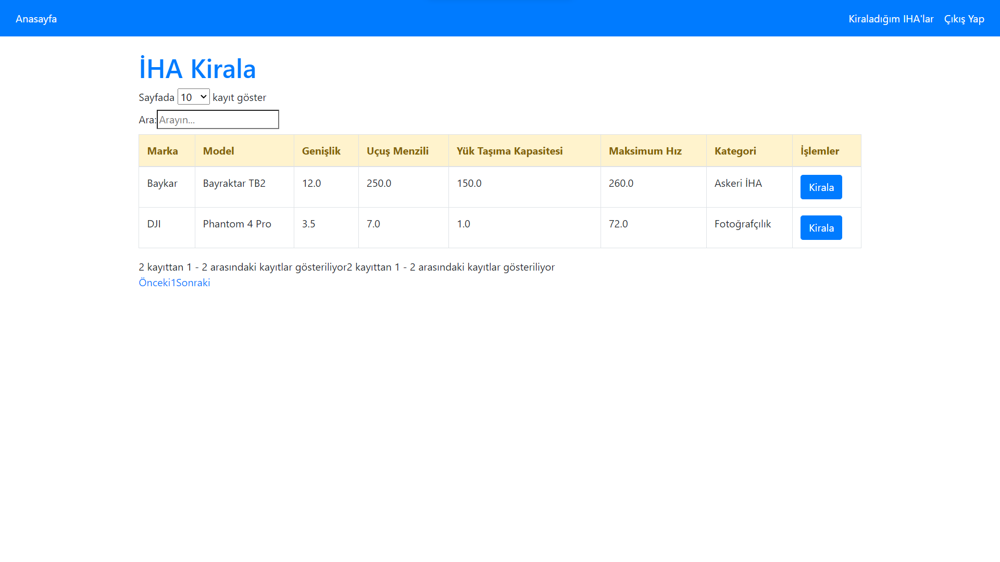
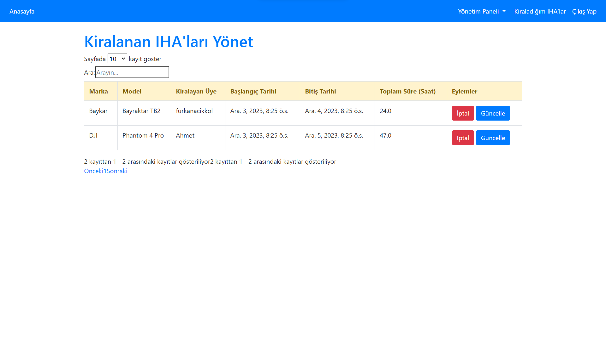
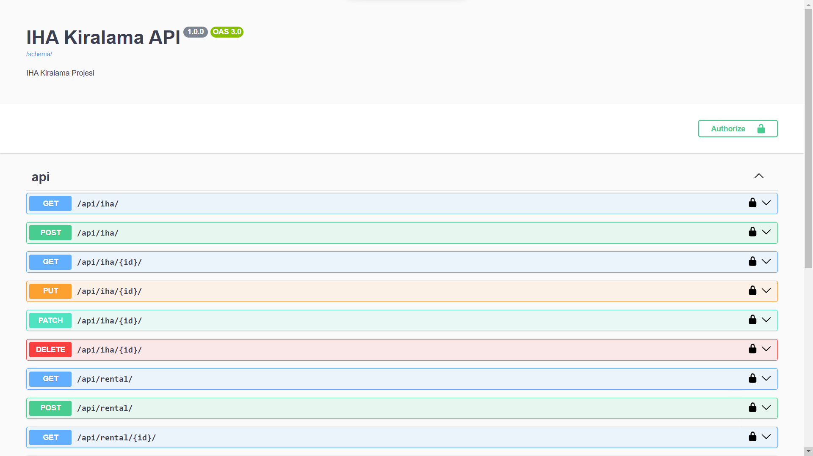
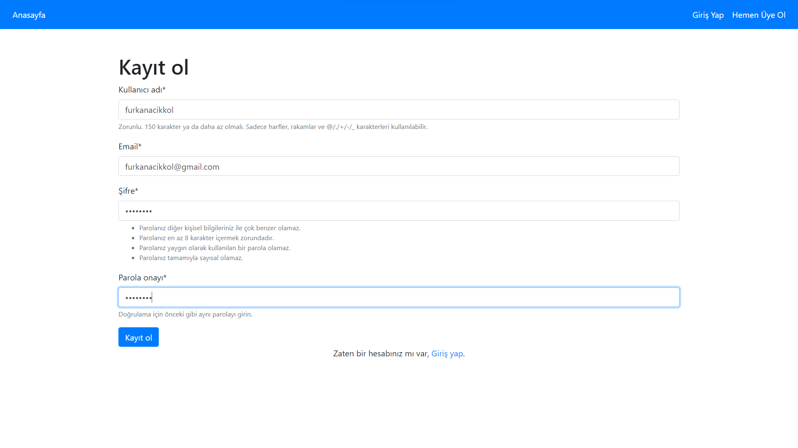

# İHA Kiralama Projesi

Bu proje, Django framework kullanılarak geliştirilmiş bir İHA (İnsansız Hava Aracı) kiralama uygulamasını içermektedir.

<p align="center">

</p>

## Başlangıç

Aşağıdaki adımları takip ederek projeyi yerel makinenizde çalıştırabilirsiniz.

### Önkoşullar

- Docker ve Docker Compose yüklü olmalıdır. [Docker İndirme Sayfası](https://www.docker.com/get-started)

### Kurulum

1. Projeyi klonlayın:

    ```bash
    git clone https://github.com/furkanacikkol/iha-kirala.git
    cd iha-kirala
    ```

2. Docker ile projeyi ayağa kaldırın:

    ```bash
    docker-compose up --build
    ```

    Bu komut, gerekli bağımlılıkları yükleyecek ve Django uygulamasını başlatacaktır.

3. Django admin paneline erişim sağlamak için superuser oluşturun:

    Yeni bir terminal açarak proje klasörüne gidin

    ```bash
    cd iha-kirala
    docker-compose exec web python manage.py createsuperuser

    Kullanıcı adı belirleyin (Boş bırakılırsa otomatik olarak 'root' olacaktır.) 
    Email adresi (Boş bırakılabilir)
    Şifre girin
    Şifrenizi tekrar girin
    
    ```
    
   

4. Tarayıcıda aşağıdaki adresi ziyaret edin:

    ```
    http://localhost:8000

    http://localhost:8000/admin
    ```

    Önceki adımda oluşturduğunuz kullanıcı adı ve şifre ile admin olarak giriş yapabilirsiniz(Admin olarak giriş yapıldığında üyelere gizli olan yönetim paneline erişebilir ve burada var olan ihaları görebilir, ekleyebilir, güncelleyebilir ve silebilirsiniz. Aynı şekilde Kiralanmış olan ihaları görebilir güncelleme veya kiralamayı iptal edebilirsiniz.)

## Kullanım

Proje başlatıldıktan sonra, İHA Kiralama uygulamanızı kullanabilir ve Django admin panelini yönetebilirsiniz.

IHA'ları yönetim ekranı:

```
http://localhost:8000/iha-list/
```




IHA kiralama ekranı:

```
http://localhost:8000/iha-rental-list/
```




IHA kiralama yönetim ekranı (Sadece admin erişebilir):

```
http://localhost:8000/rental-list/
```


Swagger UI:
```
http://localhost:8000/doc/
http://localhost:8000/redoc/
```



Kayıt Ekranı: 
<br>
<br>

